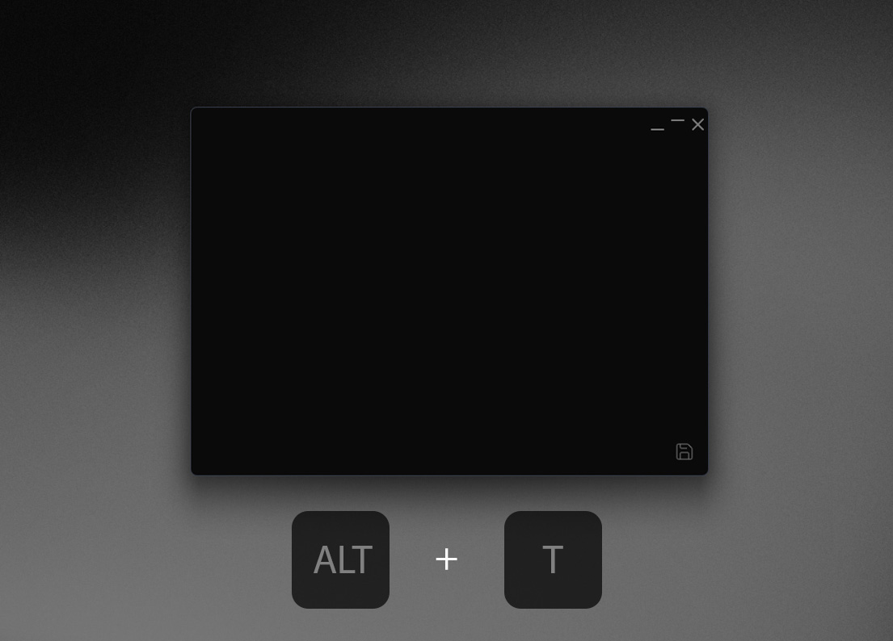
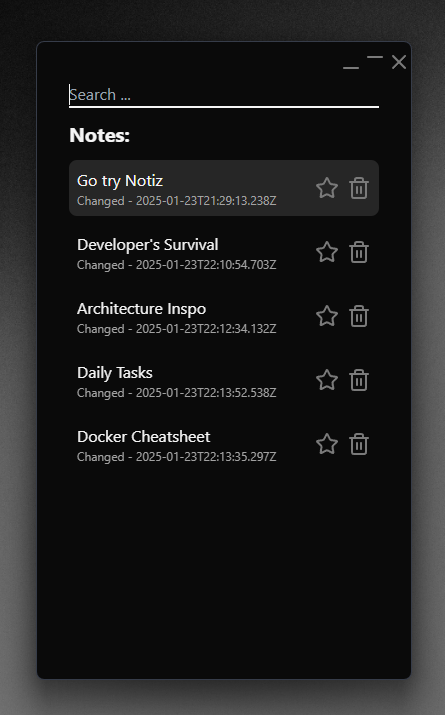
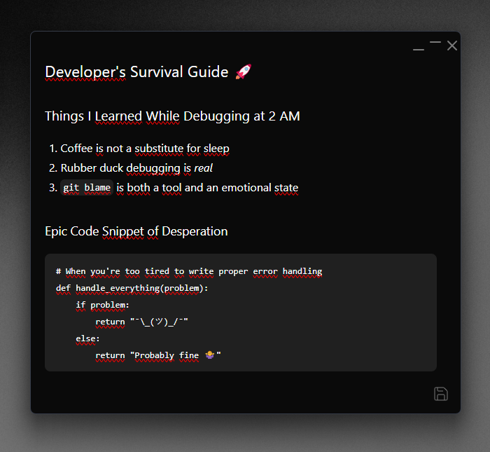

# Notiz 📝

A lightning-fast, minimalist note-taking desktop application built with Tauri and React.

## Key Features

- **Instant Note Creation**: Launch a new note window via global keyboard shortcut
- **Automatic Saving**: Notes are saved automatically as you type
- **Markdown Support**: Write notes using lightweight markdown syntax
- **Quick Search**: Global search shortcut to find notes by title
- **Lightweight & Fast**: Powered by Tauri for amazing performance

## Prerequisites

- Node.js (v20+)
- Rust (v1.84+)
- npm

## Installation

```bash
git clone https://github.com/yourusername/notiz.git
cd notiz
npm install
npm run tauri dev
```

## Usage

### Keyboard Shortcuts

- `Alt + N`: Open new note window
- `Alt + M`: Open search window

### Screenshots

<div align="center">
    
</div>
- New Note Window: Instantly create notes with markdown support
<div align="center">
    
</div>
- Note Overview: Search and browse your notes
<div align="center">
    
</div>
- Quick Launch: Global shortcut for seamless note creation


## Development

### Tech Stack

- Frontend: React
- Desktop Framework: Tauri
- Styling: Tailwind CSS
- State Management: Zustand
- Database: [NativeDb](https://github.com/vincent-herlemont/native_db)

## License

MIT License